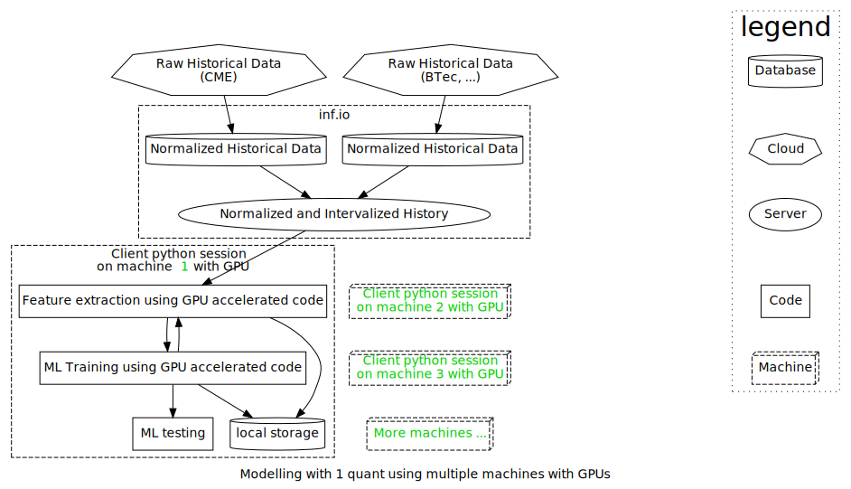
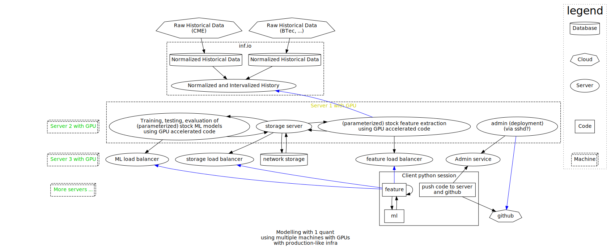

# Doc status
WIP
## TODOs:
- diagram for phase 3
- design overview for phase 3
- separate design detail doc for each phase
- link separate design detail doc in this doc
- comments/reviews
 
# Background

Execution cost modelling is a product with a large potential market. Yet the problem is often too complex to solve with a casual effort. This is especially true in the fixed income markets, where there is significant correlation between a large number of instruments.

The difficulties involved in modelling fixed income execution costs generall fall into the following categories:

- The required modelling requires significant quantitative analysis expertise.
- The correlation between a large number of instruments means that activity in all these instruments are relevant to model the execution costs in a single instrument, leading to a very high dimensionality to the problem. This often means the need for significant computing power.
- Building and evolving a model often requires collaboration between multiple analysts, requiring proper tooling.
- Coordinating significant computing power requires infrastructure that can facilitate parallelization.
- Building the necessary infrastructure to deal with parallelization and collaboration requires significant engineering expertise over a long period of time, posing a large barrier to entry.
- Using any kind of shared infrastructure to reduce the barrier to entry presents privacy and IP protection challenges.

GSA will build and deliver several related products to make it easier to incorporate execcution cost models into decision making.

- Execution cost predictions streamed either independently or through a data vendor.
- Pre-trained model objects that can be used with private data or customized in house (possibly with GSA consulting).
- A framework that can be deployed on client-owned hardware, to develop, train & tune ML-powered models, either primarily for one quant, or for a team of quants.
- Modelling as a service, where clients can explore a set of stock ML training methods on GSA infrastructure with private data.

# Requirements

## Phase 1

- Build the infrastructure necessary to train a MVP ML model using historical data.
- The training infrastructure must allow GSA to evaluate the use of GPUs to accelerate the training process.
- Build the infrastructure necessary to make predictions using a trained model, and deliver the predictions via well-defined APIs.

## Phase 2

- Improve the infrastructure to allow a large number of workflows to be scheduled, and completed asynchronously.

## Phase 3

- Improve the infrastructure to allow multiple users to submit workflows.
- The infrastructure must allow collaboration between users, including permissions, and fair allocation of computing resources.
- The infrastructure must be scaleable to allow the client to adjust the resources by acquiring or deprecating hardware.

# Overview

The project will be completed in three phases, to allow increasing amount of client-customization with each successive phase.

## Phase 1

- GSA will work with inf.io to acquire historical data that is normalized and intervalized to the specs required by GSA.
- GSA will implement GPU acceleration compatible methods for extracting various features from the historical data.
- GSA will implement GPU acceleration compatible methods for training a ML model using the extracted features.
- GSA will lease resources from AWS, and experiment with various GPU configurations to determine expected performance characteristics.
- GSA will determine the universe of hyperparameters to train and test.
- GSA will employ multiple machines to search for the optimal hyperparameter, by manually sharding the domain.
- GSA will define a RESTful API for the delivery of predictions, where requests and responses are encoded in JSON format.
- GSA will build and deploy a service to serve the predictions API.
- GSA will work with data vendors to integrate the predictions with their offerings, to be delivered to their customers as a premium service.

## Phase 2

- GSA will improve infrastructure so that loadbalancing across multiple machines can be achieved without manual sharding.
- GSA will improve infrastructure to allow work to be queued, and completed asynchronously, with notification upon completion.
- GSA will add the ability to store features and ML models in a global data store.
- Feature extraction, ML training, storage, and loadbalancing will be implemented as services using an internal API communication via protobuf.
- A client python session will be able to load existing features and models, or request new features and models by providing parameters to deployed feature extraction and modelling code.
- A GSA quant will be able to develop new feature extraction and ML code in a python session (possibly hosted on AWS on a resource with GPU access to allow for acceleration).
- New code will be submitted to github.
- GSA will build an admin service to facilitate the deployment and rollback of new code across multiple machines.  

## Phase 3
<!-- -->
